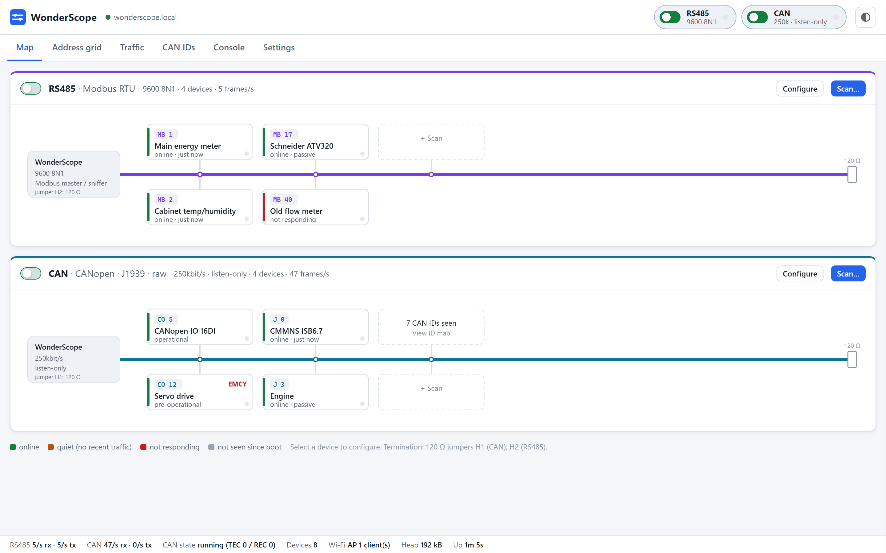
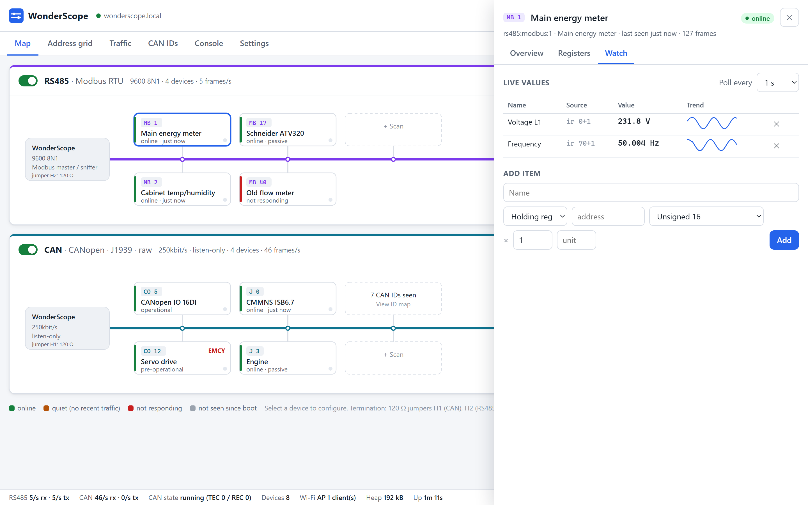
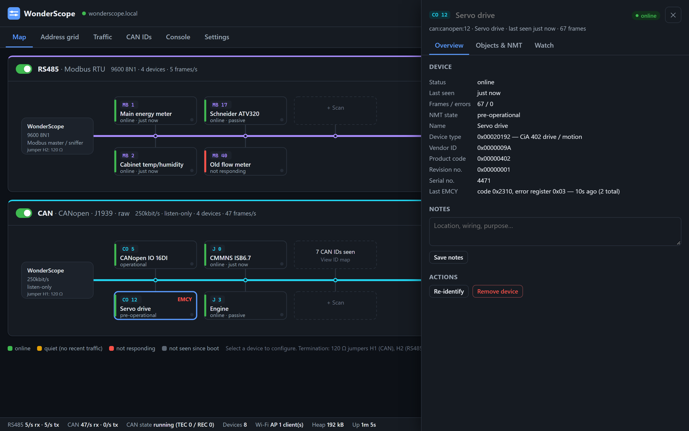
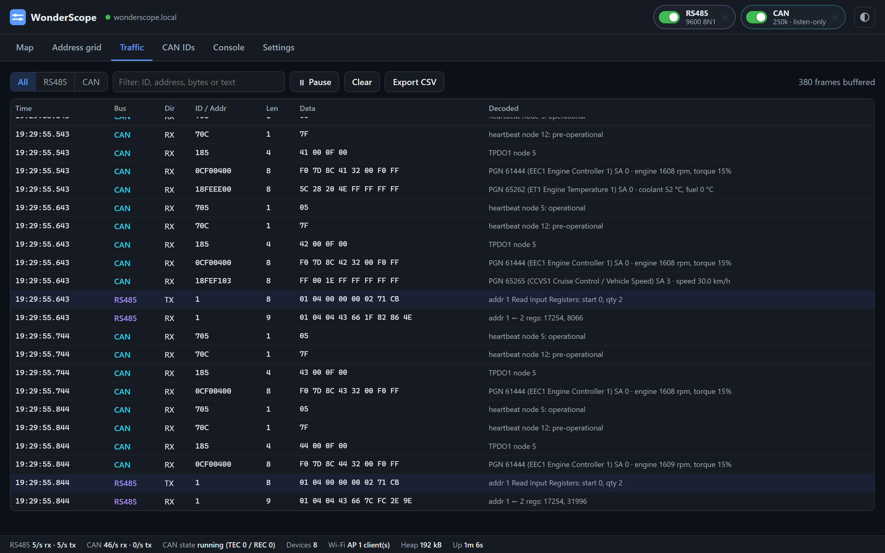
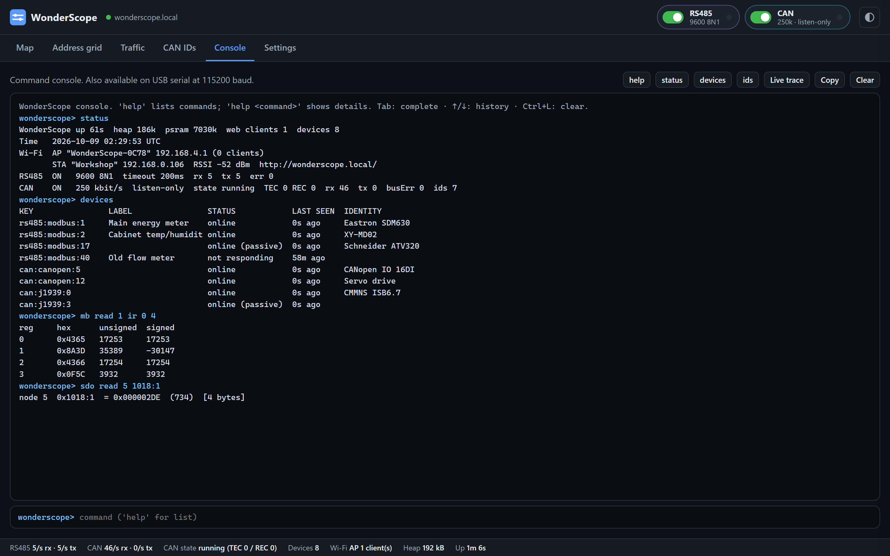
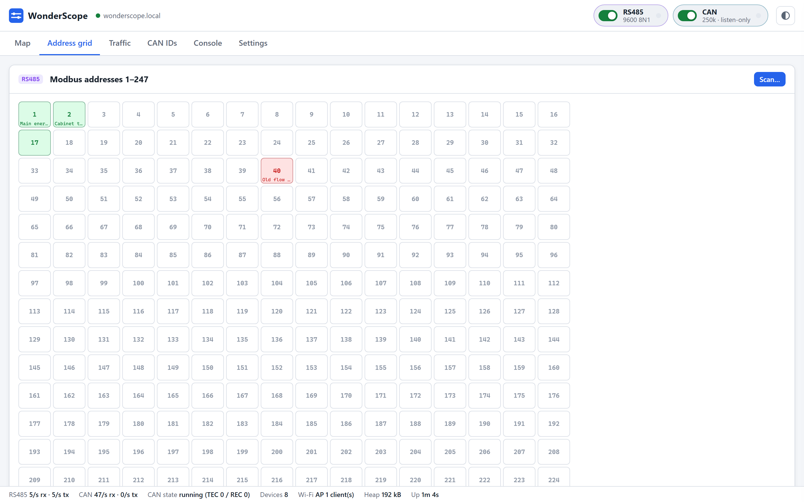

# WonderScope

RS485 / CAN bus monitor and configurator for the Waveshare ESP32-S3-RS485-CAN(-U).
Web dashboard served by the board, plus a text console on USB serial and in the dashboard.

<picture>
  <source media="(prefers-color-scheme: dark)" srcset="docs/images/map-dark.png">
  
</picture>

## Features

- **RS485 / Modbus RTU** — passive sniffing, address scan with baud/parity sweep, device identification (FC2B/0E, FC11), register and coil read/write, raw frames.
- **CAN** — listen-only by default, bitrate detection, identifier map, CANopen (SDO, NMT, heartbeat, EMCY, identity), J1939 (address claim, PGN requests, BAM reassembly), raw frames.
- **Devices** — topology map and address grid per bus, labels, notes, per-device link settings, polled watch lists. Stored on the board.
- **Traffic** — live decoded trace for both buses, filter, CSV export.
- **Console** — every function as a command, on USB serial and in the dashboard.
- **System** — Wi-Fi AP + station, mDNS, optional login, OTA update, RTC time. Light and dark themes.

## Interface

| | |
|---|---|
|  |  |
| **Device panel** — Modbus watch list with live values and trends | **CANopen node** — identity, device profile, NMT state, last EMCY |
|  |  |
| **Traffic** — RS485 and CAN frames decoded as Modbus, CANopen and J1939 | **Console** — the same commands as USB serial |

**Address grid** — every Modbus address (and CANopen node / J1939 source address); select an empty address to probe it.

Screenshots use simulated devices.

## Hardware

  
  

DIN-rail module: ESP32-S3R8 (8 MB PSRAM), 16 MB flash, isolated RS485 and CAN, 7–36 V DC or USB-C power, PCF85063 RTC.

| # | Component | # | Component |
|---|---|---|---|
| 1 | ESP32-S3 | 13 | BOOT button |
| 2 | DC-DC power module (3.3 V, 2 A) | 14 | RESET button |
| 3 | Pin header (2.0 mm) | 15 | Isolated power supply |
| 4 | Power terminal (7–36 V DC) | 16 | RS485 120 Ω termination jumper |
| 5 | USB-C | 17 | CAN 120 Ω termination jumper |
| 6 | RTC battery header (SH1.0) | 18 | RS485 / CAN terminals |
| 7 | Ceramic antenna | 19 | PCF85063 RTC |
| 8 | IPEX antenna connector | 20 | DC-DC power chip |
| 9 | 16 MB flash | 21 | ME6217C33M5G LDO |
| 10 | Digital isolator | 22 | RS485 transceiver |
| 11 | CAN transceiver | 23 | TVS diodes |
| 12 | PWR / RS485 / CAN LEDs | | |

| Function | Pins |
|---|---|
| RS485 (UART1, SP3485) | TX 17, RX 18, DE/RE 21 |
| CAN (TWAI, TJA1051) | TX 15, RX 16 |
| RTC (PCF85063, I²C) | SDA 39, SCL 38 |

Termination: fit the 120 Ω jumper only when the board is at a line end.

Hardware images © Waveshare, from the [ESP32-S3-RS485-CAN wiki](https://www.waveshare.com/wiki/ESP32-S3-RS485-CAN). Not covered by this project's license.

## Access

| Method | Address |
|---|---|
| Station (LAN) | http://wonderscope.local/ |
| Access point | SSID `WonderScope-XXXX`, password `wonderscope`, http://192.168.4.1/ |
| USB serial | 115200 baud, `help` for commands |

## Install

Download the [latest release](https://github.com/martinbogo/wonderscope/releases/latest):

- `wonderscope-<version>-factory.bin` — complete image for a new board, written over USB at offset 0:
  `python -m esptool --chip esp32s3 write-flash 0 wonderscope-<version>-factory.bin`
- `wonderscope-<version>-ota.bin` — update for a board already running WonderScope: Settings → Firmware.

## Build and flash

Requires [PlatformIO Core](https://platformio.org/install/cli) and GNU Make. On Windows, recipes use Git for Windows' shell.

| Command | Action |
|---|---|
| `make flash` | Build and install over USB |
| `make ota` | Build and install over Wi-Fi |
| `make monitor` | Serial console |
| `make backup` | Save the complete flash to `backup/` |
| `make restore IMAGE=file.bin` | Write a full flash image |
| `make` | List all targets |

Defaults are in `mk/config.mk`: serial port auto-detected, host `wonderscope.local`. Override per command (`make flash PORT=COM13`) or in `local.mk` (see `local.mk.example`).

## License

Copyright © 2026 Martin Bogomolni (martinbogo@gmail.com).
[CC BY-NC 4.0](https://creativecommons.org/licenses/by-nc/4.0/) — attribution required, non-commercial use only. Third-party components keep their own licenses; see [LICENSE](LICENSE).
